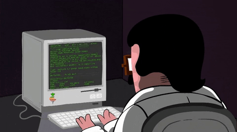

## Hi there 👋

I'm <a href="#">Igor Ujević</a> from Croatia and I'm web developer.
Curently working for <a href="https://www.intentspan.com/">IntentSpan</a>. Mostly <strong>JavaScript full-stack developer</strong>, but I also like to work with PHP. I love writing code and I'm extremely motivated, with clearly defined goals. I'm eager to advance my skills and competencies the best I possibly can. Communicative and ready to work in a team, ready to work and progress. Flexible and easily adaptable to new conditions. Responsible and open to new ideas.

## Skils, languages and tools 👨🏽‍💻

<i>
    
</i>

<i>
    
</i>

<i>
    
</i>

<i>
    
</i>

<i>
    
</i>

<i>
    
</i>

<i>
    
</i>

<i>
    
</i>

<i>
    
</i>

<i>
    
</i>

 

### Contact

  :e-mail: ujevicigor@gmail.com
  🌎 https://igorujevic.github.io/ (working on that)
   <a href="https://www.linkedin.com/in/igor-ujevi%C4%87-9a65931ab/">LinkedIn Profile</a>

### Still young, still working on myself

<!--
**igorujevic/igorujevic** is a ✨ _special_ ✨ repository because its `README.md` (this file) appears on your GitHub profile.

Here are some ideas to get you started:

- 🔭 I’m currently working on ...
- 🌱 I’m currently learning ...
- 👯 I’m looking to collaborate on ...
- 🤔 I’m looking for help with ...
- 💬 Ask me about ...
- 📫 How to reach me: ...
- 😄 Pronouns: ...
- ⚡ Fun fact: ...
-->
